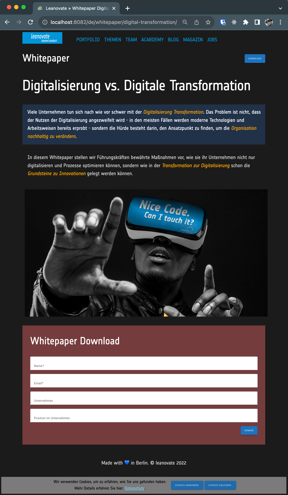

# Leanovate Web

This project serves as both an experiment and a showcase how to create landing pages using the [11ty site generator](https://www.11ty.dev/). From a technical perspective, particularly in terms of [web vitals](https://web.dev/vitals/) and related factors, this page excels and offers exceptional potential for optimizing SEO performance.

In the end this approach wasn't convincing the stakeholders, because the text maintenance via Gitlab (`/src/pages`) was too geeky.

## Screenshot

## Dev

### Installation

Follow the [getting started](https://www.11ty.dev/docs/getting-started/) instructions.

### Material

The form fields are made with Material web components.

Pro

- look and feel as Google and Android users know it
- animations make is more "fancy"
  Con
- overriding styles is difficult
- bigger footprint (loading)
- external dependencies
- look and feel constrained (can be a pro, see above)

### Material

- Github doc [textfield](https://github.com/material-components/material-components-web/tree/master/packages/mdc-textfield)
- Material.io doc [textfield](https://material.io/components/text-fields/web#using-text-fields)

- Material.io doc [buttons](https://material.io/components/buttons/web#using-buttons)

### Todos

- [x] Finish form: Material button
- [x] Create Answering Page
- [ ] Fix cookie clicks
- [x] Validate form
- [ ] Send asynchronly
- [ ] Handle errors while sending
- [ ] Create footer
- [ ] Create header
- [ ] Create menu
- [ ] Fix responsive image loading
- [ ] Create Fav Logo (incl. manifest.json)
- [ ] Translate to English
- [x] Connect form to backend
- [ ] Make confirmation and download page generic
